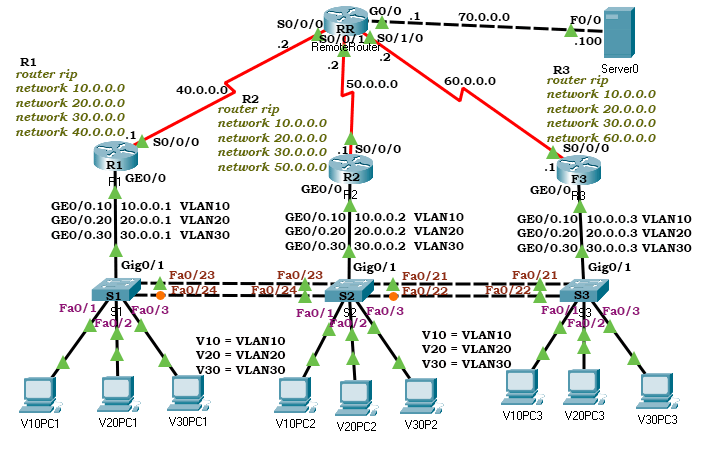
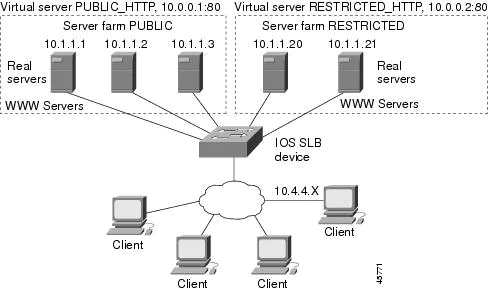

# HSRP Configuration

HSRP (Hot Standby Router Protocol) is a Cisco proprietary protocol. It is used to dynamically manage multiple default gateway routers. It creates a group and adds all available gateway routers to that group. Afterward, it selects two routers: one as the main (or active) router and the other as the standby (or passive) router.



## R1 config

```
R1>enable
R1#configure terminal
R1(config)#interface Serial0/0/0
R1(config-if)#ip address 40.0.0.1 255.0.0.0
R1(config-if)#no shutdown
R1(config-if)#exit
R1(config)#interface gigabitEthernet 0/0
R1(config-if)#no ip address
R1(config-if)#no shutdown
R1(config-if)#exit
R1(config)#interface gigabitEthernet 0/0.10
R1(config-subif)#encapsulation dot1Q 10
R1(config-subif)#ip address 10.0.0.1 255.0.0.0
R1(config-subif)#exit
R1(config)#interface gigabitEthernet 0/0.20
R1(config-subif)#encapsulation dot1Q 20
R1(config-subif)#ip address 20.0.0.1 255.0.0.0
R1(config-subif)#exit
R1(config)#interface gigabitEthernet 0/0.30
R1(config-subif)#encapsulation dot1Q 30
R1(config-subif)#ip address 30.0.0.1 255.0.0.0
R1(config-subif)#exit
R1(config)#router rip
R1(config-router)#network 10.0.0.0
R1(config-router)#network 20.0.0.0
R1(config-router)#network 30.0.0.0
R1(config-router)#network 40.0.0.0
R1(config-router)# exit
R1(config)#
```

## R2 config

```
R2>enable
R2#configure terminal
R2(config)#interface Serial0/0/0
R2(config-if)#ip address 50.0.0.1 255.0.0.0
R2(config-if)#no shutdown
R2(config-if)#exit
R2(config)#interface gigabitEthernet 0/0
R2(config-if)#no ip address
R2(config-if)#no shutdown
R2(config-if)#exit
R2(config)#interface gigabitEthernet 0/0.10
R2(config-subif)#encapsulation dot1Q 10
R2(config-subif)#ip address 10.0.0.2 255.0.0.0
R2(config-subif)#exit
R2(config)#interface gigabitEthernet 0/0.20
R2(config-subif)#encapsulation dot1Q 20
R2(config-subif)#ip address 20.0.0.2 255.0.0.0
R2(config-subif)#exit
R2(config)#interface gigabitEthernet 0/0.30
R2(config-subif)#encapsulation dot1Q 30
R2(config-subif)#ip address 30.0.0.2 255.0.0.0
R2(config-subif)#exit
R2(config)#router rip
R2(config-router)#network 10.0.0.0
R2(config-router)#network 20.0.0.0
R2(config-router)#network 30.0.0.0
R2(config-router)#network 50.0.0.0
R2(config-router)# exit
```

## R2 config

```
R3>enable
R3#configure terminal
R3(config)#interface gigabitEthernet 0/0.10
R3(config-subif)#standby 10 ip 10.0.0.10
R3(config-subif)#standby 10 priority 110
R3(config-subif)#exit
R3(config)#interface gigabitEthernet 0/0.20
R3(config-subif)#standby 20 ip 20.0.0.10
R3(config-subif)#exit
R3(config)#interface gigabitEthernet 0/0.30
R3(config-subif)#standby 30 ip 30.0.0.10
R3(config-subif)#standby 30 priority 120
R3(config-subif)#standby 30 preempt
R3(config-subif)#exit
R3(config)#
```

# Cisco IOS Server Load Balancing Configuration

The SLB feature is a Cisco IOS-based solution that provides IP server load balancing

 1. The network administrator defines a virtual server that represents a group of real servers in a cluster of network servers known as a server farm. In this environment the clients are configured to connect to the IP address of the virtual server.
2. The virtual server IP address is configured as a loopback address, or secondary IP address, on each of the real servers.
3. When a client initiates a connection to the virtual server, the IOS SLB function chooses a real server for the connection based on a configured load-balancing algorithm. 



## Public Server farm configuration

```
ip slb serverfarm PUBLIC
  real 10.1.1.1
    reassign 2
    faildetect numconns 4 numclients 2
    retry 20
    inservice
    exit
  real 10.1.1.2
    reassign 2
    faildetect numconns 4
    retry 20
    inservice
    exit
  real 10.1.1.3
    reassign 2
    faildetect numconns 4
    retry 20
    inservice
    end
```

## Restricted server farm configuration 

```
ip slb serverfarm RESTRICTED
  real 10.1.1.20
    reassign 2
    faildetect numconns 4
    retry 20
    inservice
    exit
  real 10.1.1.21
    reassign 2
    faildetect numconns 4
    retry 20
    inservice
    end
```

## Virtual client configuration

```
ip slb vserver PUBLIC_HTTP
  virtual 10.0.0.1 tcp www
  serverfarm PUBLIC
  idle 120
  delay 5
  inservice
  exit
ip slb vserver RESTRICTED_HTTP
  virtual 10.0.0.2 tcp www
  serverfarm RESTRICTED
  idle 120
  delay 5
  inservice
  end
```


### sources:

- https://www.computernetworkingnotes.com/ccna-study-guide/hsrp-configuration-and-load-balancing-explained.html
- https://www.cisco.com/c/en/us/td/docs/ios/slb/configuration/guide/slb_cg_book/slb_cg_xmp.html