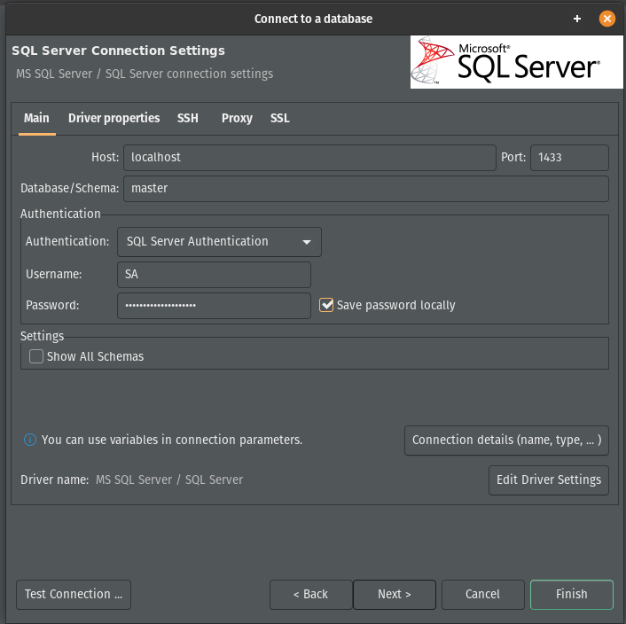
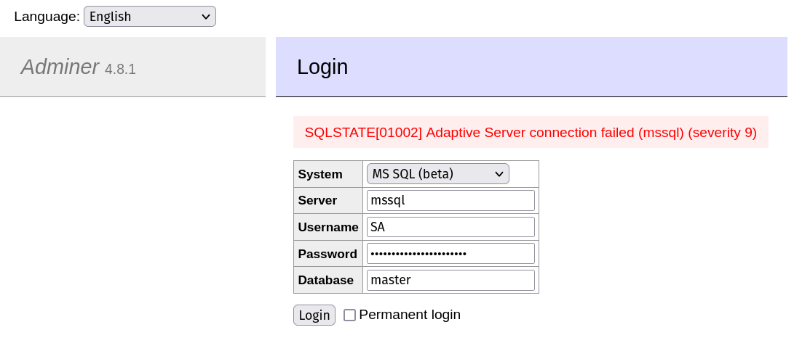

## Install docker

### Set up the repository

Update the apt package index and install packages to allow apt to use a repository over HTTPS:

```
 sudo apt-get update

 sudo apt-get install \
    ca-certificates \
    curl \
    gnupg \
    lsb-release
```

### Add Docker’s official GPG key:

```
 sudo mkdir -p /etc/apt/keyrings

 curl -fsSL https://download.docker.com/linux/ubuntu/gpg | sudo gpg --dearmor -o /etc/apt/keyrings/docker.gpg
```

Use the following command to set up the repository:

```
     echo \
      "deb [arch=$(dpkg --print-architecture) signed-by=/etc/apt/keyrings/docker.gpg] https://download.docker.com/linux/ubuntu \
      $(lsb_release -cs) stable" | sudo tee /etc/apt/sources.list.d/docker.list > /dev/null
```


## Install Docker Engine

Update the apt package index, and install the latest version of Docker Engine, containerd, and Docker Compose, or go to the next step to install a specific version:

```
 sudo apt-get update

 sudo apt-get install docker-ce docker-ce-cli containerd.io docker-compose-plugin

 ```

 ## Create MSSQL container

Pull the image:

```
docker pull mcr.microsoft.com/mssql/server:2022-latest
```

Run the container

 ```
 docker run -e "ACCEPT_EULA=Y" -e "MSSQL_SA_PASSWORD=yourStrong(!)Password" -p 1433:1433 -d mcr.microsoft.com/mssql/server:2022-latest
 ```

 Connect to container using DBeaver:

 

 ## dokcer-compose

 ```yaml
 version: "3.0"

services:
  mssql:
    image: mcr.microsoft.com/mssql/server:2022-latest
    environment:
      - ACCEPT_EULA=Y
      - MSSQL_SA_PASSWORD="yourStrong(!)Password"
    ports: 
      - 1433:1433
    networks:
      - sql_network
  adminer:
    image: adminer
    ports:
      - 8080:8080
    networks:
      - sql_network
    depends_on:
      - mssql

networks:
  sql_network:
    driver: bridge
 ```

Start the services:

 ```
 docker-compose up
 ```

On the port 8080 `adminer` is listening.
We can connect to the db with `adminer`:



### Sources:

- https://docs.docker.com/engine/install/
- https://hub.docker.com/_/microsoft-mssql-server